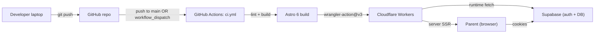

# Cloudflare Integration & Deployment Plan

Aligned with the recommendation in [context/foundation/infrastructure.md](../../foundation/infrastructure.md). Phases run top-down; each item is a tracked checkbox. Edge-case sections at the bottom are referenced by phase items where relevant.

Scope decisions (from clarifying questions):

- **CI/CD**: GitHub Actions only — auto-deploy on push to `main` + `workflow_dispatch` for manual deploys.
- **Environments**: Production only. Staging and PR previews intentionally deferred (the path is documented in infrastructure.md "Getting Started" tail).

---

## Architecture (target end state)



Runtime secrets (`SUPABASE_URL`, `SUPABASE_KEY`) live in Cloudflare (set once via `wrangler secret put`). GitHub secrets hold only the Cloudflare credentials needed by Actions (`CLOUDFLARE_API_TOKEN`, `CLOUDFLARE_ACCOUNT_ID`) plus build-time copies of `SUPABASE_URL`/`SUPABASE_KEY` already used by the lint+build job.

---

## Phase 0 — Prerequisites (no code changes)

- [x] Confirm Cloudflare account exists and capture **Account ID** (Workers & Pages → Overview → right sidebar). → [prerequisites-record.md](./prerequisites-record.md)
- [x] Confirm Supabase project: capture project URL and anon key for production.
- [x] Decide hostname for first deploy: `rafcio-czyta.<account-subdomain>.workers.dev` (free) — custom domain deferred.
- [x] Local: Node v22.14.0 (matches [.nvmrc](../../../.nvmrc)), Docker not required (Supabase is hosted).

---

## Phase 1 — Local config hygiene

- [x] Rename the Worker in [wrangler.jsonc](../../../wrangler.jsonc): change `"name": "10x-astro-starter"` → `"name": "rafcio-czyta"` so the deployed Worker matches the project. Keep everything else as-is — `compatibility_date: 2026-05-08`, `nodejs_compat`, `assets` binding, and `observability.enabled` are already correct.
- [x] Create `.dev.vars` at repo root (gitignored already per [.gitignore](../../../.gitignore) line 21) by copying [.env.example](../../../.env.example) and filling `SUPABASE_URL` / `SUPABASE_KEY`. Wrangler reads `.dev.vars`, not `.env`, for the workerd runtime.
- [x] Smoke-test locally: `npm run dev`, hit `/`, `/auth/signin`, `/dashboard`. Confirms the Cloudflare Vite plugin loads `.dev.vars` and the Supabase client in [src/lib/supabase.ts](../../../src/lib/supabase.ts) gets a non-null result. (`/` and `/auth/signin` → 200; `/dashboard` → redirect to `/auth/signin`; dev log: `Using secrets defined in .dev.vars`.)

---

## Phase 2 — First manual production deploy (one-time, from laptop)

- [x] `npx wrangler login` (browser OAuth, one-time per machine).
- [x] `npx wrangler whoami` — verify the account ID matches Phase 0. Account ID `2c788d5ea383324e978394f1cda7696a` → [phase-2-record.md](./phase-2-record.md)
- [x] Push runtime secrets to the production Worker — these are NOT bundled into the build because [astro.config.mjs](../../../astro.config.mjs) declares them with `access: "secret"`:
  - `npx wrangler secret put SUPABASE_URL`
  - `npx wrangler secret put SUPABASE_KEY`
- [x] `npm run build` (Astro 6 outputs to `dist/`; `assets.directory` in [wrangler.jsonc](../../../wrangler.jsonc) already points there).
- [x] `npx wrangler deploy` — published after `workers.dev` subdomain registered. Version `9335ad39-4075-4342-974c-13f39091a55c` → [phase-2-record.md](./phase-2-record.md)
- [x] Capture the assigned URL; smoke-test `/` and `/dashboard` (latter should redirect to `/auth/signin` because [src/middleware.ts](../../../src/middleware.ts) gates it). URL: `https://rafcio-czyta.krzysztof-pupowski.workers.dev` — `/` → 200, `/dashboard` → 302 → `/auth/signin`.
- [x] Open the Cloudflare dashboard and **check for auto-provisioned bindings** (see Edge Case A); if any appear, add them to [wrangler.jsonc](../../../wrangler.jsonc) before the next deploy. SESSION KV + IMAGES added to [wrangler.jsonc](../../../wrangler.jsonc).

---

## Phase 3 — Supabase external integration

- [ ] In Supabase dashboard → Authentication → URL Configuration:
  - Set **Site URL** to the production `*.workers.dev` URL.
  - Add the same URL (and any planned custom domain) to **Redirect URLs**.
  - Exact values: [phase-3-record.md](./phase-3-record.md)
- [ ] Manually test the full auth round-trip on production: signup → confirm-email link → signin → `/dashboard`. This catches cookie/SameSite issues (Edge Case B) before CI deploys start landing.
- [ ] If email confirmation links fail, check that the confirm-email template uses `{{ .SiteURL }}` and that the production URL is the Site URL, not a stale localhost value.

---

## Phase 4 — GitHub Actions: auto + manual deploy

- [ ] In Cloudflare dashboard → My Profile → API Tokens → "Create Token" → use the **"Edit Cloudflare Workers"** template (scopes: `Account: Workers Scripts:Edit`, `Account: Account Settings:Read`, `User: Memberships:Read`, `User: User Details:Read`, Zone read for any custom domain). Copy the token immediately — it's shown only once.
- [ ] Add GitHub Actions secrets (web UI **or** GitHub CLI — see [gh-cli-setup.md](./gh-cli-setup.md)):
  - `CLOUDFLARE_API_TOKEN`
  - `CLOUDFLARE_ACCOUNT_ID`
  - Confirm `SUPABASE_URL` and `SUPABASE_KEY` already exist (used by the current build job).
  - CLI: `gh secret set CLOUDFLARE_API_TOKEN` (etc.); verify with `.\scripts\gh-verify-setup.ps1`.
- [x] Extend [.github/workflows/ci.yml](../../../.github/workflows/ci.yml):
  - Add `workflow_dispatch:` to the `on:` triggers (manual deploys).
  - Split the file into two jobs: keep the existing `ci` job (lint + build on push/PR), and add a `deploy` job that **`needs: ci`** and runs only on `push` to `main` or `workflow_dispatch`.
  - The `deploy` job re-runs `npm ci` + `npm run build` (uploading artifacts across jobs is overkill for an MVP) and then invokes `cloudflare/wrangler-action@v3` with `apiToken` + `accountId`. No `command:` needed — the action defaults to `wrangler deploy`, which reads [wrangler.jsonc](../../../wrangler.jsonc). → [phase-4-record.md](./phase-4-record.md)

Sketch of the deploy job (final wording will be tightened during implementation):

```yaml
on:
  push:
    branches: [master]
  pull_request:
    branches: [master]
  workflow_dispatch:

jobs:
  ci:
    # unchanged: lint + build

  deploy:
    needs: ci
    if: github.event_name == 'push' || github.event_name == 'workflow_dispatch'
    runs-on: ubuntu-latest
    steps:
      - uses: actions/checkout@v4
      - uses: actions/setup-node@v4
        with:
          node-version: 22
          cache: npm
      - run: npm ci
      - run: npx astro sync
      - run: npm run build
        env:
          SUPABASE_URL: ${{ secrets.SUPABASE_URL }}
          SUPABASE_KEY: ${{ secrets.SUPABASE_KEY }}
      - uses: cloudflare/wrangler-action@v3
        with:
          apiToken: ${{ secrets.CLOUDFLARE_API_TOKEN }}
          accountId: ${{ secrets.CLOUDFLARE_ACCOUNT_ID }}
```

- [ ] Validation: trigger `workflow_dispatch` from the Actions tab first (low risk, deliberate). Watch the run, then visit the Worker URL. If deploy fails with `Authentication error [code: 10000]`, re-issue the API token per [phase-4-record.md](./phase-4-record.md).
- [ ] Validation: open a trivial PR (e.g. README typo), confirm `ci` runs but `deploy` is skipped on PR. Merge and confirm `deploy` runs on `main` push.

---

## Phase 5 — Observability, rollback, cost safety

- [ ] `npx wrangler tail` against `rafcio-czyta` while hitting the site — confirms live log stream works.
- [ ] In CF dashboard → Workers & Pages → `rafcio-czyta` → Observability — confirm logs/metrics are populated (already enabled in [wrangler.jsonc](../../../wrangler.jsonc)).
- [ ] Document rollback in [README.md](../../../README.md):
  - `npx wrangler versions list`
  - `npx wrangler versions deploy <VERSION_ID> --message "rollback: <reason>"`
  - Note: rollback reverts Worker code only — **not** Supabase schema/data (Edge Case C).
- [ ] CF dashboard → Manage Account → Billing → set **spend notifications** (email at $1 / $5 thresholds) — guards against the "unexpected Workers Paid charges" risk in infrastructure.md.
- [x] Add a short "Deploy" section to [README.md](../../../README.md) covering: manual deploy command, GH Actions auto/manual deploy, rollback, and how to push new secrets.

---

## Edge Cases & Extra Support

### Edge Case A — Auto-provisioned bindings after first deploy

Cloudflare's first deploy can silently create a session KV namespace or an Images binding (called out in infrastructure.md "Unknown Unknowns"). If the dashboard shows bindings not present in [wrangler.jsonc](../../../wrangler.jsonc):

1. Add them explicitly to `wrangler.jsonc` (e.g. `kv_namespaces`, `services`) with their dashboard IDs.
2. Re-deploy locally to confirm idempotency.
3. Commit the updated `wrangler.jsonc`. CI deploys will then use the same bindings deterministically.

### Edge Case B — Supabase cookies on `*.workers.dev`

Production cookies from [src/lib/supabase.ts](../../../src/lib/supabase.ts) must round-trip across `*.workers.dev` ↔ `*.supabase.co`. If signin appears to succeed but `/dashboard` keeps redirecting to `/auth/signin`:

1. Check browser DevTools → Application → Cookies for the `sb-*` cookies on the Worker domain.
2. If missing, confirm `cookies.set` options in the Supabase SSR client aren't forcing `SameSite=Strict`; `Lax` is appropriate.
3. Confirm Supabase Site URL exactly matches the Worker URL (no trailing slash, https only).

### Edge Case C — Rollback gotchas

- `wrangler versions deploy` rolls back Worker code only. Any Supabase migrations applied between versions stay applied; plan forward-only Supabase migrations.
- Propagation across Cloudflare's edge can take a few minutes; don't assume rollback is instantly global.
- If a deploy ships a config change to [wrangler.jsonc](../../../wrangler.jsonc) (e.g. new binding), `versions deploy` of an older version reverts to that version's bundled config too — be deliberate.

### Edge Case D — workerd vs Node incompatibilities

`nodejs_compat` covers most packages, but heavy AI SDKs or native modules can still fail at runtime despite a green build (called out in infrastructure.md Devil's Advocate item 2). When adding a new dependency:

1. Run `npm run dev` first — failures there are workerd-level, not Astro-level.
2. If a runtime error mentions `node:` modules at deploy-time, prefer a fetch-based or `cloudflare:*`-compatible alternative.
3. Keep LLM calls (per [context/foundation/prd.md](../../foundation/prd.md) FR-003) as outbound `fetch` to a hosted provider — never bundle heavy SDKs into the Worker.

### Edge Case E — CI deploy fails authentication or KV bindings

| Error | Cause | Fix |
|-------|--------|-----|
| `Authentication error [code: 10000]` | Invalid token or wrong account | Re-issue **Edit Cloudflare Workers** token; include account `2c788d5ea383324e978394f1cda7696a` |
| `kv bindings require kv write perms [code: 10023]` | Token lacks **Workers KV Storage** edit | Same template, or custom token with **Workers KV Storage → Edit** (required for `SESSION` KV in [wrangler.jsonc](../../../wrangler.jsonc)) |

1. Re-issue the token using the **"Edit Cloudflare Workers"** template (includes KV write), or add **Workers KV Storage Edit** on a custom token.
2. Confirm the token's "Account Resources" includes the target account.
3. `CLOUDFLARE_API_TOKEN=… CLOUDFLARE_ACCOUNT_ID=… npx wrangler whoami` locally, then `npm run build && npx wrangler deploy` to validate before re-running CI.

### Edge Case F — Fork PR previews

Out of scope (production-only), but worth noting: Fork PRs in GitHub Actions don't have access to secrets, so even when previews are added later, fork PRs will skip the deploy job. Document this when (and if) staging/previews land.

---

## Out of Scope (per clarifying questions)

- Staging environment (`CLOUDFLARE_ENV=staging` per-env build — Astro 6 requires a separate build per environment, per [Astro adapter docs](https://docs.astro.build/en/guides/integrations-guide/cloudflare/)).
- PR preview deployments.
- Custom domain attachment.
- LLM provider wiring for FR-003 (separate workstream).
- Supabase D1/R2 co-location.

These are all tracked indirectly in [infrastructure.md](../../foundation/infrastructure.md) and can be added on top of this baseline without rework.
